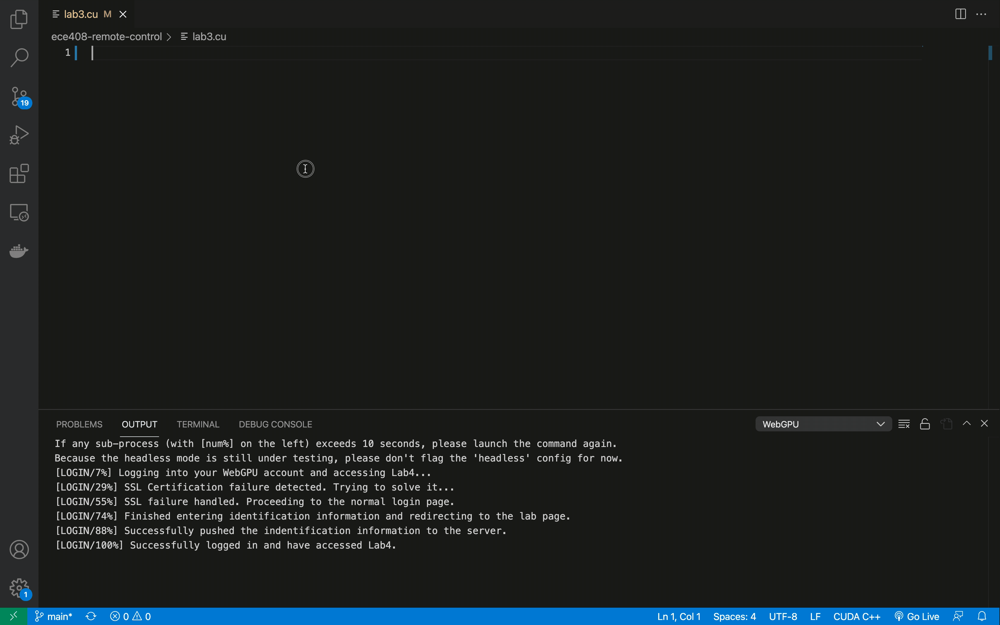

# Your next WebGPU, is not WebGPU

[TOC]

## Introduction


## Functionality

My extension uses your code created locally onto VS Code and use them for posting on the webgpu website and automatically use it for running the tests online.

## Getting started

Before you can use the extension, there are some setting-up steps to follow.

### Install the NPM dependencies

```shell
npm install
```
### Install the Chrome driver

You also need to install `chromedriver` into your system `PATH`.

-   You must download exactly the same version of `chromedriver` as your chrome browser if you want to use the `chromedriver` as your selenium driver. The chrome browser on your machine is likely to be updated automatically when a new version is released. In this case, please update to the newest version of `chromedriver` too.
-   I strongly recommend you to install the `chromedriver` into the system software directory immediately, i.e. it should appear in `/usr/local/bin/chromedriver`.

### Install the other extensions

In your VS Code workspace, please install the following extensions:

-   `vscode-cudacpp`: CUDA C++ syntax highlight.

### Working file

When starting, you should use the VS Code to open your `.cu` CUDA source , for example,

```shell
code lab1.cu
```

Note that you **must** use `.cu` as the postfix of your working file, or the extension `vscode-cudacpp` will **not** be able to recognize the file as a valid CUDA C++ file.

### Network connection

For students in China, make sure you’re equipped with a VPN so that you can gain a fast connection with the WebGPU server held in UIUC.

## Working steps

| Shortcut | Canonical Press | Step | Frequency            |
| -------- | --------------- | ---- | -------------------- |
| `f1`     | `> config`      | 1    | often 1 time         |
| `f2`     | `> login`       | 2    | often 1 time         |
| `f3`     | `> pull`        | 3    | often 1 time         |
| `f5`     | `> push`        | 4    | often multiple times |
| `f12`    | `> exit`        | 5    | often 1 time         |

Note that the **Canonical Press** means you need to firstly press the combined keys `shift+ctrl/cmd+p` on your keyboard.

### Config

After creating the working file (`lab2.cu` in my case), please use VS Code to open it. Make sure you’ve done all things mentioned in the *Getting Started* part. 

Then please type in `ctrl/cmd+shift+p`. and then `config`, or simple `f1`, and follow the hints in the box to enter your personal information.


### Login

This part is fully automated. Just type in `f2` and everything is set. After this step you will be on the code editing page.


### Pull



## Push

## Possible Improvements

-   Try to change *selenium* to **headless** mode.
-   After changing the input parameters, the parser seems crashed.

## Contributions

If you want to contribute to the code, please contact Haob.19@intl.zju.edu.cn to send **pull requests** to the [GitHub Repo](https://github.com/BiEchi/ece408-remote-control).

Before you start, please make sure you’ve already completed all steps in the *requirements* part.

### Set up your working environment

If you want to test your code after you make refinements to my code, please **make sure** there are no bugs. To debug, use the framework provided by Microsoft VS Code.

```shell
npm install -g yo generator-code
yo code // then follow the default settings
```

To renew versions on the VS Code Extension Marketplace, please type 

```shell
npm i vsce -g # if you did not install vsce
vsce package # if you want to make a package
vsce publish # if you want to publish immediately
```

## Acknowledgements


## Release Notes

For the Release Notes part, please refer to [CHANGELOG](./CHANGELOG.md) for details.
