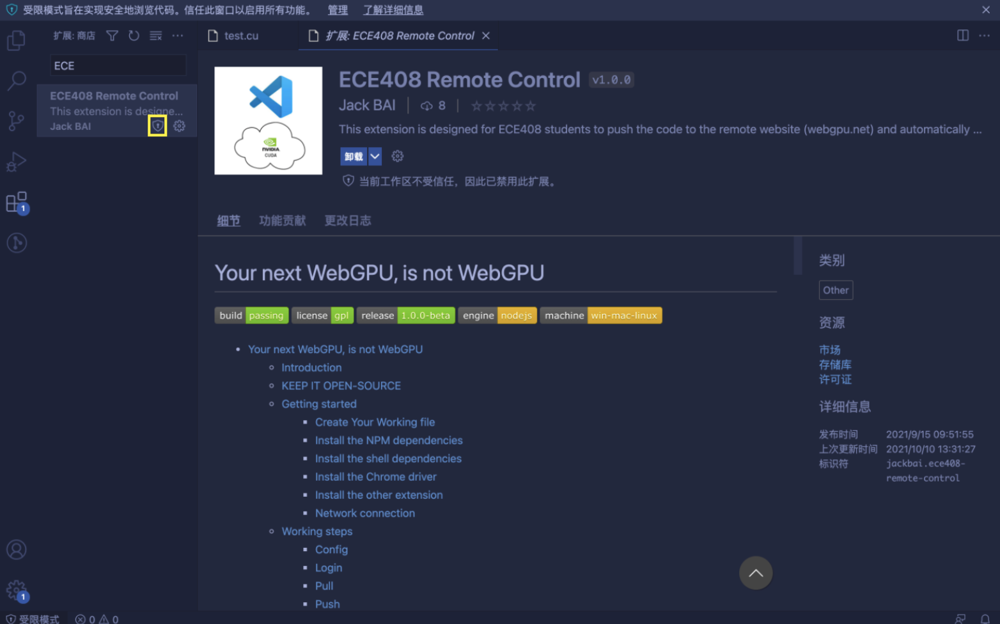

# Your next WebGPU, is not WebGPU
   
 

- [Your next WebGPU, is not WebGPU](#your-next-webgpu-is-not-webgpu)
  - [Introduction](#introduction)
  - [KEEP IT OPEN-SOURCE](#keep-it-open-source)
  - [Getting started](#getting-started)
    - [Create Your Working file](#create-your-working-file)
    - [Install ECE408 Remote Control Extension](#install-ece408-remote-control-extension)
    - [Install the shell dependencies](#install-the-shell-dependencies)
    - [Install the Chrome driver](#install-the-chrome-driver)
      - [Before started](#before-started)
      - [Check for the right version of Chrome](#check-for-the-right-version-of-chrome)
      - [Download the correct version of chromedriver](#download-the-correct-version-of-chromedriver)
    - [Install the other extension](#install-the-other-extension)
    - [Network connection](#network-connection)
  - [Working steps](#working-steps)
    - [Config](#config)
    - [Login](#login)
    - [Pull](#pull)
    - [Push](#push)
    - [Exit](#exit)
  - [Possible Improvements](#possible-improvements)
  - [Issue Report](#issue-report)
  - [Contributions](#contributions)
    - [Set up your working environment](#set-up-your-working-environment)
    - [Renew the Extension Version](#renew-the-extension-version)
  - [Acknowledgements](#acknowledgements)
  - [Release Notes](#release-notes)

## Introduction

Recently, programming on the Web is developing quickly, and [SaaS](https://en.wikipedia.org/wiki/Software_as_a_service) has never been so popular. In UIUC, [WebGPU](https://www.webgpu.net/) is developed for [ECE408 (Applied Parallel Programming)](https://ece.illinois.edu/academics/courses/ece408) students to write, compile, and debug their code. However, as the architecture for WebGPU is not yet fully developed, and because of the natural difficulty to render code on HTML pages, we can observe that many students complain about this interface and they try to use other methods to code.

On the other side, [VS Code](https://code.visualstudio.com/) has never been so popular because of its strong support for every language and its huge extension community. VS Code is also strong because it's **pure** editor, so it's compatible to all of the operating systems, including Windows, Mac, Linux, etc.

I hereby, introduce a VS Code Extension called [ECE 408 Remote Control](https://marketplace.visualstudio.com/items?itemName=JackBAI.ece408-remote-control), which allows students to use their code created locally, using VS Code as the editor with decent syntax highlighting systems, and use the extension for posting the code back onto the WebGPU website, automatically running the tests online, and show the results on the Chrome browser.

## KEEP IT OPEN-SOURCE


As a steady supporter of the [open source software movement](https://en.wikipedia.org/wiki/Free_software_movement), for most of the time I'd like to make my softwares open. Therefore, this extension is under the [The GNU General Public License](./LICENSE). If you want to make any form of edit to it, please make sure you keep it open source.

## Getting started

Before you can use the extension, there are some setting-up steps to follow.


### Create Your Working file

When starting, you should use the VS Code to open your `.cu` CUDA source , for example,

```shell
code /path/to/your/workdir/lab1.cu
```

Note that you **must** use `.cu` as the postfix of your working file, or the extension `vscode-cudacpp` will **not** be able to recognize the file as a valid CUDA C++ file.


### Install ECE408 Remote Control Extension

To set up the working environment, you need to install my extension first. After you install it, you can see the interface as shown below. Please click on the "security" and trust my extension button if it is not yet trusted.



### Install the shell dependencies

`If` you're currently using Mac, use 
```shell
brew install pbcopy
```

`If` you're currently using Windows, `clip.exe` should already be in your system PATH. You can open `Powershell` and type in `ls | clip.exe` to check.

### Install the Chrome driver

You also need to install `chromedriver` into your system `PATH`.

#### Before started

Before you install the chromedriver, you should have:


Then you need to install the `chromedriver`. 

#### Check for the right version of Chrome

Please open the current Chrome (if you have) and check which version you're in. For example, mine is 94.0.4606.


#### Download the correct version of chromedriver

Go to [the download website](https://chromedriver.chromium.org/) to download the correct version of ChromeDriver. If you're using Windows, make sure you download the Windows version. I'm using Mac, so I'll download the Mac version.


After downloading, please unzip the file and move it to your system PATH.


Then please check whether you've successfully installed your chromedriver. If you see the feedback below, you're all set.


Notes:
-   You must download exactly the same version of `chromedriver` as your chrome browser if you want to use the `chromedriver` as your selenium driver. The chrome browser on your machine is likely to be updated automatically when a new version is released. In this case, please update to the newest version of `chromedriver` too.
-   I strongly recommend you to install the `chromedriver` into the system software directory immediately, i.e. it should appear in `/usr/local/bin/chromedriver`.

### Install the other extension

In your VS Code workspace, please install the following extensions:

-   `vscode-cudacpp`: CUDA C++ syntax highlight.

### Network connection

For students in China, make sure you’re equipped with a VPN so that you can gain a fast connection with the WebGPU server held in UIUC.

## Working steps

| Shortcut | Canonical Press | Step | Frequency            |
| -------- | --------------- | ---- | -------------------- |
| `f1`     | `> config`      | 1    | often 1 time         |
| `f2`     | `> login`       | 2    | often 1 time         |
| `f3`     | `> pull`        | 3    | often 1 time         |
| `f5`     | `> push`        | 4    | often multiple times |
| `f12`    | `> exit`        | 5    | often 1 time         |

Note that the **Canonical Press** means you need to firstly press the combined keys `shift+ctrl/cmd+p` on your keyboard.

### Config

After creating the working file (`lab2.cu` in my case), please use VS Code to open it. Make sure you’ve done all things mentioned in the *Getting Started* part. 

Then please type in `ctrl/cmd+shift+p`. and then `config`, or simple `f1`, and follow the hints in the box to enter your personal information.


### Login

This part is fully automated. Just type in `f2` and everything is set. After this step you will be on the code editing page.


### Pull

This part is fully automated. Just type in `f3` and everything is set. After this step the code on the WebGPU page will be automatically added to your working file.


### Push

This part is fully automated. Just type in `f5` and everything is set. After this step your code in your working file will be automatically pushed onto the WebGPU website, saved, and also submitted for feedbacks.


### Exit

This part is to simply exit the Chrome browser and shut down the Internet connection to keep your account safe.


## Possible Improvements

-   Try to change *selenium* to **headless** mode, and move the HTML rending part to local workspace.

## Issue Report

If you find an issue or have some more features to request, please reply on the [Github Issues Page](https://github.com/BiEchi/ece408-remote-control/issues). Please do NOT post it on CampusWire, which is dedicated for course-related contents.

## Contributions

If you want to contribute to the code, please contact Haob.19@intl.zju.edu.cn to send **pull requests** to the [GitHub Repo](https://github.com/BiEchi/ece408-remote-control).

Before you start, please make sure you’ve already completed all steps in the *requirements* part.

### Set up your working environment

If you want to test your code after you make refinements to my code, please **make sure** there are no bugs. To debug, use the framework provided by Microsoft VS Code.

```shell
npm install -g yo generator-code
yo code // then follow the default settings
```

### Renew the Extension Version

To renew versions on the VS Code Extension Marketplace, please type 

```shell
npm i vsce -g # if you did not install vsce
vsce package # if you want to make a package
vsce publish # if you want to publish immediately
```

## Acknowledgements

I need to express my greatest thanks to [Professor Kindratenko](mailto:kindrtnk@illinois.edu), who encouraged me to go on with this VS Code extension. I also need to thank [TA Andrew Schuh](mailto:aschuh@illinois.edu), who is also the maintainer of WebGPU, who provided me with the web API for the `pull` part of the extension. Gratitudes are also given to my peer student and teammate [Zhenzuo SI](mailto:zhenzuo.19@intl.zju.edu.cn), who encouraged me to develop such a tool.

Although all people mentioned above did not contributed directly to any part of this extension, they provided me with the greatest warmth and appreciation, without which I cannot develop such a functional tool. Thanks to all of you!


## Release Notes

For the Release Notes part, please refer to [CHANGELOG](./CHANGELOG.md) for details.
